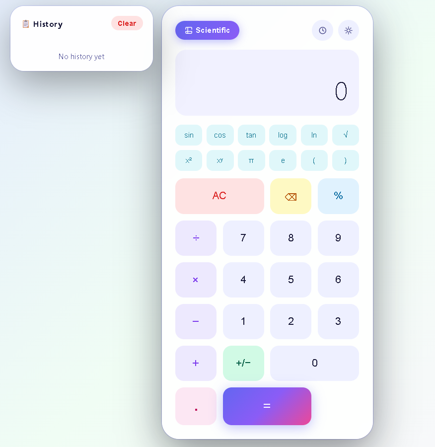
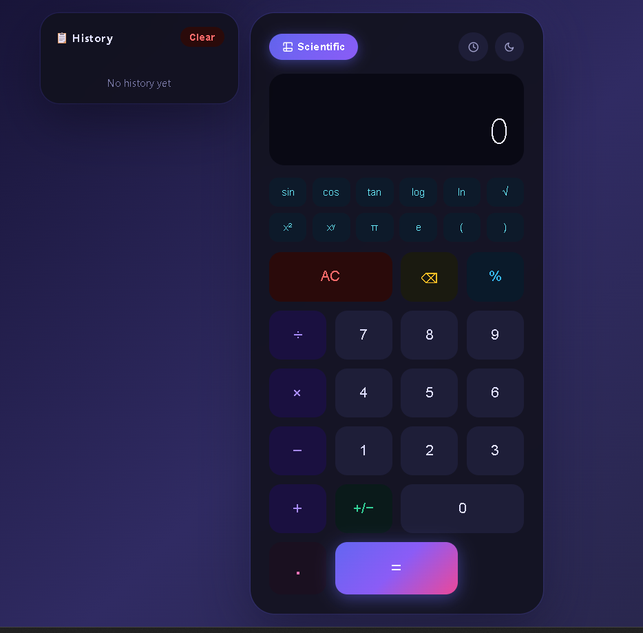

<div align="center">


<br/><br/>

# 🧮 Calculator Pro

### A sleek, feature-rich calculator with scientific mode, history tracking, themes & sound effects

<br/>

[](https://yashsoni972.github.io/CodeAlpha_Calculator-Pro/)

<br/>

</div>

---

## 📸 Preview

<div align="center">

### ☀️ Light Mode &nbsp;&nbsp;&nbsp;&nbsp;&nbsp;&nbsp;&nbsp;&nbsp;&nbsp;&nbsp;&nbsp;&nbsp;&nbsp;&nbsp;&nbsp;&nbsp;&nbsp;&nbsp;&nbsp;&nbsp;&nbsp;&nbsp;&nbsp;&nbsp;&nbsp; 🌙 Dark Mode

 &nbsp;&nbsp; 

</div>

---

## ✨ Features

| Feature | Description |
|---|---|
| 🧮 **Standard Calculator** | Full arithmetic — add, subtract, multiply, divide |
| 🔬 **Scientific Mode** | sin, cos, tan, log, ln, √, x², xʸ, π, e, parentheses |
| 🎨 **Dark / Light Theme** | Toggle between themes with smooth transitions |
| 📋 **Calculation History** | Stores last 50 calculations with localStorage |
| 🔊 **Sound Effects** | Professional click tones for digits, operators, equals & errors |
| ⌨️ **Keyboard Support** | Full keyboard input support |
| 💥 **Ripple Effects** | Material-style ripple on every button press |
| 🎯 **Operation Indicator** | Live label shows ADD / SUBTRACT / MULTIPLY / DIVIDE |
| 🎨 **Multi-Color Buttons** | Each button group has its own distinct color |

---

## 🚀 Live Demo

👉 **[https://yashsoni972.github.io/CodeAlpha_Calculator-Pro/](https://yashsoni972.github.io/CodeAlpha_Calculator-Pro/)**

---

## 🛠️ Tech Stack

- **HTML5** — Semantic structure
- **CSS3** — CSS variables, animations, transitions, grid layout
- **Vanilla JavaScript** — Web Audio API for sounds, localStorage for history

---

## 📁 Project Structure

```
CodeAlpha_Calculator-Pro/
├── index.html        # Main HTML structure
├── style.css         # Themes, layout & animations
├── script.js         # Logic, audio engine & keyboard support
├── lightmode.png     # Light theme preview
├── darkmode.png      # Dark theme preview
└── README.md         # You are here!
```

---

## ⚡ Getting Started

```bash
# 1. Clone the repository
git clone https://github.com/yashsoni972/CodeAlpha_Calculator-Pro.git

# 2. Open in browser
cd CodeAlpha_Calculator-Pro
open index.html
```

No dependencies. No build tools. Just open and use! 🎉

---

## 🌐 Enable Live Demo (GitHub Pages)

```
Go to your repo on GitHub:
Settings → Pages → Branch → main → / (root) → Save

Your site will be live at:
https://yashsoni972.github.io/CodeAlpha_Calculator-Pro/
```

---

## 🎮 How to Use

- **Numbers & Operators** — Click buttons or use your keyboard
- **Scientific Mode** — Click the `Scientific` button to expand extra functions
- **History** — Click the 🕐 icon to view past calculations; click any entry to reuse it
- **Theme** — Click the moon/sun icon to toggle dark/light mode

**Keyboard Shortcuts:**

| Key | Action |
|-----|--------|
| `0-9` | Input digits |
| `+ - * /` | Operators |
| `%` | Percent |
| `Enter` or `=` | Calculate |
| `Backspace` | Delete last digit |
| `Escape` | Clear all |

---

## 👨‍💻 Author

**Yash Soni**
- GitHub: [@yashsoni972](https://github.com/yashsoni972)
- LinkedIn: [Yash Soni](https://www.linkedin.com/in/yash-soni-b46682355/)
